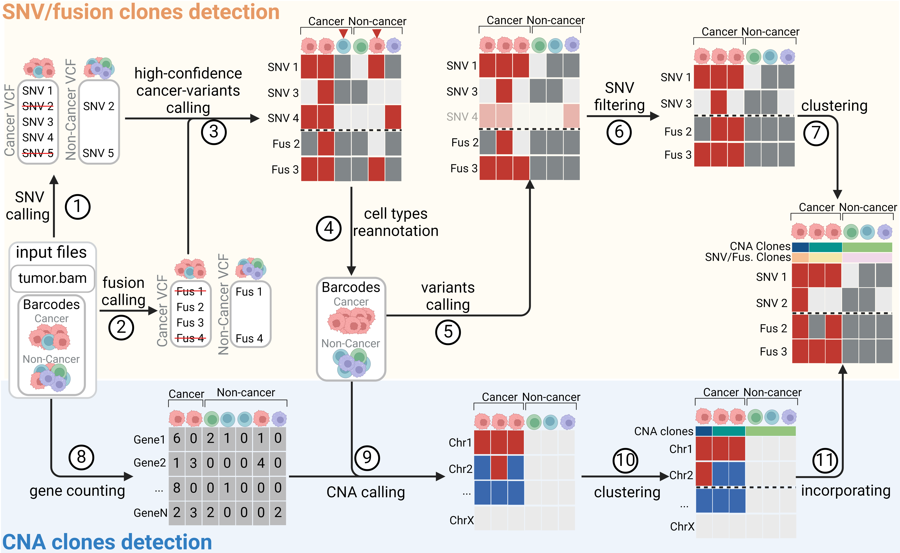

# LongSom
A [Snakemake](https://snakemake.github.io/) workflow for calling somatic SNVs, fusions, and CNAs in high-quality long-read single-cell RNA-seq cancer samples, and infer subclonal structures based on those variants.

LongSom takes a bam file and a barcodes file as input. Before calling variants, it performs a cell types reannotation step for improved results. For more informations about the methods, please read our Genome Research publication [Dondi et al. 2025](https://genome.cshlp.org/content/35/4/900.long).

For more information, including installation and usage, please visit our [Wiki](https://github.com/cbg-ethz/LongSom/wiki).

## Workflow
 

## Cite
If you use LongSom, please cite:

 Arthur Dondi, Nico Borgsmüller, Pedro Ferreira, Brian Haas, Francis Jacob, Viola Heinzelmann-Schwarz, Tumor Profiler Consortium, Niko Beerenwinkel. De novo detection of somatic variants in high-quality long-read single-cell RNA sequencing data. [Genome Research](https://genome.cshlp.org/content/35/4/900.long) (2025)

 In addition, please cite [SComatic](https://www.nature.com/articles/s41587-023-01863-z) if you use LongSom for SNV detection, [CTAT-LR-fusion](https://www.biorxiv.org/content/10.1101/2024.02.24.581862v1.full) for fusion detection, and [BnpC](https://doi.org/10.1093/bioinformatics/btaa599) for subclonal structure reconstruction.
 
